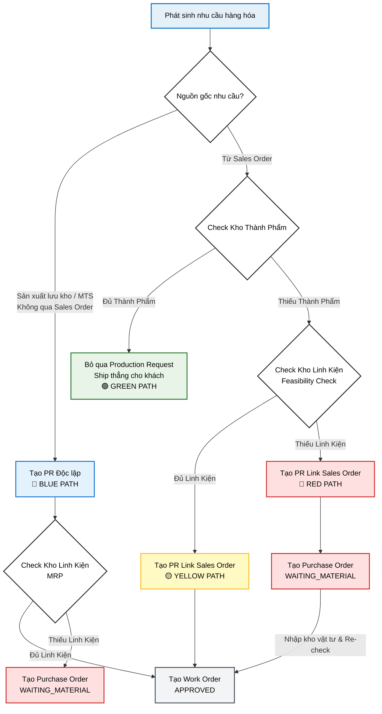

# Production Request: Business & Technical Logic (SSOT)

> **Feature:** Production Request
> **Role:** Single Source of Truth (SSOT) for the "How and Why" of the Production Request module.
> **Audience:** Backend Developers, Architects, and AI Agents.

---

## 1. The Core Philosophy
Production Requests (PR) act as the **Buffer Zone** between Customer Demand (Sales) and Factory Execution (Work Orders). We do not automate creation; we provide the data for a Manager to decide.

---

## 2. The "Traffic Light" System (State Machine)

The system calculates feasibility in two phases to optimize performance.

### Phase 1: The Fast Check (Dashboard Load)
To avoid N+1 query bottlenecks, the Sales Order dashboard only does a shallow check on **Finished Goods**.
*   **🟢 GREEN (Available to Promise):** `Finished Goods >= Order Qty`.
    *   *Action:* Warehouse clicks **"Create Shipment"**.
*   **⚫ GRAY (Unchecked / Needs Production):** `Finished Goods < Order Qty`.
    *   *Action:* Production Manager clicks **"Check Feasibility"** to trigger the Deep Check.

### Phase 2: The Deep Check (On-Demand)
Triggered manually to run the MRP/BOM explosion.
*   **🟡 YELLOW (Capable to Promise):** `Component Stock` sufficient for production.
    *   *Action:* Manager clicks **"Request Production"** -> Status becomes `APPROVED`.
*   **🔴 RED (Material Shortage):** `Component Stock` insufficient.
    *   *Action:* Manager clicks **"Request Production"** -> Status becomes `WAITING_MATERIAL`.

### Other States
*   **🔵 BLUE (Make-to-Stock / MTS):** A PR created without a `SalesOrderId`. Used for replenishment.
*   **🟣 PARTIALLY_FULFILLED:** When some Work Orders are linked but the full quantity isn't yet in production.

---

## 3. Backend Logic: The "How & Why"

### A. MTO vs. MTS Logic
We support both **Make-to-Order** (linked to `soDetailId`) and **Make-to-Stock** (independent).
*   **Why?** Small factories often combine small customer orders with extra "buffer" stock to fill a production batch efficiently.
*   **Constraint:** An MTO PR is strictly locked to its Sales Order line item to ensure traceability.

### B. Atomic ID Generation (`PR-YYYYMMDD-XXXX`)
PR codes are generated using a Date-based prefix and a random 4-digit suffix.
*   **Engineering Note:** To prevent race conditions during high-volume creation, the service uses a **Retry Loop (3 attempts)**. If a `P2002` unique constraint error occurs on the `code` field, it regenerates and retries.

### C. The MRP "Lazy" Check
The `createRequest` method runs `MrpService.calculateRequirements` **before** database insertion.
*   **Why?** We want the status (`APPROVED` vs `WAITING_MATERIAL`) to be deterministic at the moment of creation.
*   **Concurrency Trap:** Between the "Check" and the "Save," stock could be taken by another user. We use database transactions to ensure that if a request is `APPROVED`, it has a valid claim on components at that microsecond.

### D. Partial Fulfillment & Split Batches
A single `ProductionRequest` can be fulfilled by multiple `WorkOrders`.
*   **Data Model:** Tracked via the `WorkOrderFulfillment` junction table.
*   **Naming Convention:** We use `AllocatedQuantity` in the `ComponentStock` table. This represents components "earmarked" for a Work Order that haven't physically left the warehouse yet.

---

## 4. Architectural Gotchas (Technical Reference)

> [!IMPORTANT]
> **Separation of Creator/Approver:** For Sales Orders, the creator cannot approve. However, for **Production Requests**, we allow the Production Manager to both create and "Approve" (by releasing to WO) because speed is prioritized over financial audit in the shop-floor loop.

### Race Condition Mitigation
In `SalesOrderService.approveSO`, we use a **Hard Stock Reservation (FIFO)**. 
- Specific `SerialNumbers` (ProductInstances) are tagged with the `salesOrderId` immediately.
- This prevents a common MES bug where two salesmen "see" the same 1 remaining unit and both promise it to different customers.

### Missing API Gaps
*   **Serial Picker:** Currently, the frontend lacks an endpoint to query *available* serial numbers reserved for a specific SO.
*   **Wastage Buffer:** The current BOM explosion assumes 100% yield. In electronics (SMT), we should eventually add a `% Wastage` factor to raw material requirements.

---
