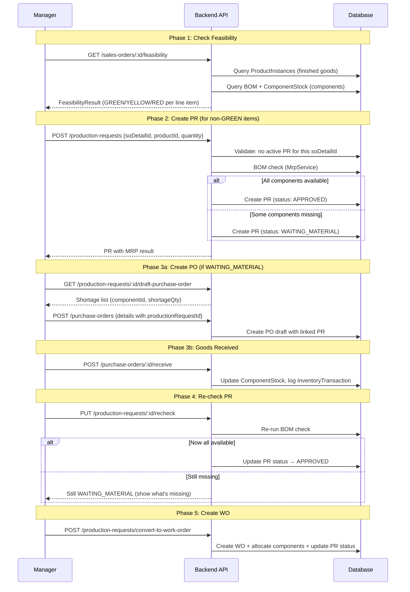

# Production Request Feature — Implementation Plan

> **Context:** This document is the single source of truth for the Production Request feature redesign.
> It captures **all architectural decisions** made during brainstorming and provides a step-by-step plan for implementation.
> This plan should be read in a **new conversation** — it is self-contained.

---

## 1. Background & Goal

The MES system follows a **Sales Order → Production Request → Work Order** flow. When a Sales Order is approved, the system checks finished goods inventory. If insufficient, the manager creates a **Production Request (PR)** to trigger manufacturing. The PR runs a **BOM check** to determine if components are available:
- **All components available** → PR is `APPROVED` → Manager can create a Work Order.
- **Some/all components missing** → PR is `WAITING_MATERIAL` → Manager creates a Purchase Order for the shortage.

### What This Plan Changes
The current `ProductionRequest` implementation has placeholder logic. This redesign aligns it with the full MES lifecycle, integrating it tightly with `SalesOrderDetail`, `MrpService`, and `PurchaseOrder`.

---

## 2. Agreed Architectural Decisions

> These were decided during brainstorming. **Do not revisit** unless explicitly requested.

| Decision | Choice | Rationale |
|----------|--------|-----------|
| PR links to | `soDetailId` (not `salesOrderId`) | A PR targets one product, which maps to one SO line item |
| Auto-populate PR quantity | Yes, from shortage calculation | Better UX, fewer errors |
| One PR per product | Yes | Schema enforces single `productId` per PR |
| One active PR per SO line item | Yes, enforced by system | Prevents accidental double-production |
| PR statuses | `APPROVED`, `WAITING_MATERIAL`, `PARTIALLY_FULFILLED`, `FULFILLED`, `CANCELLED` | Simplified — no `PENDING` (BOM check is instant), no `REJECTED` (no management gate) |
| Shipment strategy | All-or-Nothing (MVP) | Dramatically simpler |
| Mixed components | Block Everything | If ANY component is RED, entire PR → `WAITING_MATERIAL` |
| Re-check trigger | Manual button (MVP) | Manager clicks "Re-check Feasibility" |
| PO creation from PR | Pre-fill shortage components | System fills PO draft, manager picks supplier/price |
| PO-PR link | `productionRequestId` FK on `PurchaseOrderDetail` | Informational traceability |
| Forced Conversion | No (MVP) | No negative inventory |
| Wastage Buffer | No (MVP) | Use raw BOM quantities |
| Kitting | Logical deduction only | No physical kitting list |
| MTS (Make-to-Stock) | Supported | `soDetailId = null`, manager enters product/qty manually |
| Multiple POs same component | Allowed | No aggregation for MVP |
| PO button visibility | Only when `WAITING_MATERIAL` | `APPROVED` means no PO needed |

---

## 3. Feasibility Check — The "Hybrid Fast-Path" Logic

This is the core new feature. To balance performance (avoiding N+1 BOM explosions) with immediate visibility for the warehouse, the system uses a **Hybrid Fast-Path (Two-Phase)** approach:

1. **Phase 1 (The Fast Check - On Load):** When the dashboard loads, the system quickly checks `Finished Goods` availability. If sufficient, it shows 🟢 **Green** immediately. If not, it shows ⚫ **Gray** (Unchecked).
2. **Phase 2 (The Deep Check - On Demand Lazy Evaluation ):** For Gray orders, the user clicks "Check Feasibility" to trigger the heavy BOM explosion, which calculates 🟡 **Yellow** or 🔴 **Red**.

### API: `GET /api/sales-orders/:id/feasibility`

**Logic:**
```
For each SalesOrderDetail (line item):
  1. Count ProductInstance WHERE status = 'IN_STOCK' AND productId = X
     → If count >= quantity → 🟢 GREEN (can ship, no PR needed)

  2. If not GREEN → BOM Explosion (via MrpService):
     For each BOM component:
       - requiredQty = quantityNeeded × (orderQty - finishedGoodsAvailable)
       - availableQty = SUM(ComponentStock.quantity - ComponentStock.allocatedQuantity)
       - If availableQty >= requiredQty → 🟡 YELLOW
       - If availableQty < requiredQty  → 🔴 RED (shortage = requiredQty - availableQty)

  3. Line-item overall status = worst-case of its components:
     - All components OK → 🟡 YELLOW (can produce)
     - Any component short → 🔴 RED (need PO first)
```

**Response shape:**
```typescript
interface FeasibilityResult {
  salesOrderId: number;
  overallStatus: 'GREEN' | 'YELLOW' | 'RED' | 'MIXED';
  lineItems: {
    soDetailId: number;
    productId: number;
    productName: string;
    orderedQty: number;
    finishedGoodsAvailable: number;
    status: 'GREEN' | 'YELLOW' | 'RED';
    existingPrId?: number;   // If a PR already exists for this line
    existingPrStatus?: string;
    components?: {
      componentId: number;
      componentName: string;
      requiredQty: number;
      availableQty: number;
      shortageQty: number;
      status: 'YELLOW' | 'RED';
    }[];
  }[];
}
```

> **Note:** This endpoint should be accessible from the SO detail page.
> Do **NOT** add this to `salesOrderService.ts`. Create a dedicated `feasibilityService.ts` under `src/production/mrp/` — it's fundamentally an MRP operation (BOM explosion + stock check), so it belongs alongside `mrpService.ts`.

---

## 4. Production Request — Redesigned State Machine

```
Create PR (BOM check runs instantly in same transaction)
  ├─ All components OK    → APPROVED
  └─ Any component short  → WAITING_MATERIAL

WAITING_MATERIAL → (manager clicks "Re-check") → APPROVED (if now available)
APPROVED → (create WO) → PARTIALLY_FULFILLED or FULFILLED
PARTIALLY_FULFILLED → (create more WOs) → FULFILLED
Any active state → CANCELLED
```

### PR Available Actions by Status

| PR Status | Available Actions |
|-----------|-------------------|
| `WAITING_MATERIAL` | `[Create Purchase Order]`, `[Re-check Feasibility]`, `[Cancel]` |
| `APPROVED` | `[Create Work Order]`, `[Cancel]` |
| `PARTIALLY_FULFILLED` | `[Create Work Order]` (remaining qty), `[Cancel]` |
| `FULFILLED` | View only |
| `CANCELLED` | View only |

---

## 5. Proposed Changes

### 5.1 Schema Changes

#### [MODIFY] [schema.prisma](file:///d:/program/mes-mini/backend/prisma/schema.prisma)

**Change 1: Update `ProductionRequestStatus` enum**
```diff
 enum ProductionRequestStatus {
-  PENDING
   APPROVED
-  REJECTED
+  WAITING_MATERIAL
   PARTIALLY_FULFILLED
   FULFILLED
   CANCELLED
 }
```

**Change 2: Update `ProductionRequest` model — replace `salesOrderId` with `soDetailId`**
```diff
 model ProductionRequest {
   // ... existing fields ...
-  salesOrderId          Int?                    @map("sales_order_id")
+  soDetailId            Int?                    @map("so_detail_id")
   // ... existing fields ...
-  salesOrder            SalesOrder?             @relation(fields: [salesOrderId], references: [salesOrderId])
+  salesOrderDetail      SalesOrderDetail?       @relation(fields: [soDetailId], references: [soDetailId])
   // ... existing fields ...
 }
```

**Change 3: Add `productionRequests` relation to `SalesOrderDetail`**
```diff
 model SalesOrderDetail {
   // ... existing fields ...
+  productionRequests ProductionRequest[]
   // ... existing fields ...
 }
```

**Change 4: Remove `productionRequests` relation from `SalesOrder`**
```diff
 model SalesOrder {
   // ... existing fields ...
-  productionRequests  ProductionRequest[]
   // ... existing fields ...
 }
```

**Change 5: Add `productionRequestId` FK to `PurchaseOrderDetail`**
```diff
 model PurchaseOrderDetail {
   // ... existing fields ...
+  productionRequestId  Int?               @map("production_request_id")
+  productionRequest    ProductionRequest?  @relation(fields: [productionRequestId], references: [productionRequestId])
   // ... existing fields ...
 }
```

**Change 6: Add `purchaseOrderDetails` relation to `ProductionRequest`**
```diff
 model ProductionRequest {
   // ... existing fields ...
+  purchaseOrderDetails PurchaseOrderDetail[]
   // ... existing fields ...
 }
```

> **⚠️ Migration Impact:** This is a **breaking schema change**. Existing data with `salesOrderId` on `ProductionRequest` will need migration. Since this is pre-production (MVP), a `prisma migrate dev` with data reset is acceptable.

---

### 5.2 Service Layer Changes

---

#### [NEW] [feasibilityService.ts](file:///d:/program/mes-mini/backend/src/production/mrp/feasibilityService.ts)

New service under `src/production/mrp/` (co-located with `mrpService.ts`). Contains:
- `checkSalesOrderFeasibility(salesOrderId: number)` → Returns `FeasibilityResult` (the Traffic Light response)
- Uses `getBulkAvailableStock()` from `SalesOrderService` for finished goods check
- Uses `MrpService.calculateRequirements()` for BOM explosion on non-GREEN items
- Considers `ComponentStock.allocatedQuantity` when calculating available components

---

#### [MODIFY] [productionRequestService.ts](file:///d:/program/mes-mini/backend/src/production/productionRequests/productionRequestService.ts)

**Major rewrite.** Current 202 lines → estimated ~350 lines.

| Method | Change |
|--------|--------|
| `createRequest()` | **Rewrite.** Accept `soDetailId` instead of `salesOrderId`. Run BOM check (via `MrpService`) in the same transaction. Set status to `APPROVED` or `WAITING_MATERIAL` directly. Enforce one active PR per `soDetailId`. |
| `approveRequest()` | **Remove.** No manual approval gate. |
| `rejectRequest()` | **Remove.** No rejection flow. |
| `recheckFeasibility(id)` | **New.** Re-runs BOM check on a `WAITING_MATERIAL` PR. If all components now available → transitions to `APPROVED`. |
| `draftPurchaseOrder(id)` | **New.** Returns the shortage list formatted as PO line items (componentId, shortageQty). Frontend uses this to pre-fill a PO creation form. |
| `cancelRequest()` | **Modify.** Update status constraints (remove `REJECTED`/`PENDING` references). If PR has linked PO details, add warning note. Release any component allocations if applicable. |
| `getRequestById()` | **Modify.** Update `include` to use `salesOrderDetail` instead of `salesOrder`. Add linked PO info via `purchaseOrderDetails`. |
| `getAllRequests()` | **Modify.** Update `include` and `where` filters for new status values. |

**Key `createRequest()` redesign:**
```typescript
async createRequest(data: CreateProductionRequestData, userId: number) {
  // 1. Validate product has BOM
  // 2. If soDetailId provided:
  //    a. Validate SalesOrderDetail exists and SO is APPROVED
  //    b. Enforce: no other active PR for this soDetailId
  //    c. Auto-calculate shortage qty (orderedQty - finishedGoods)
  // 3. Run BOM check (MrpService.calculateRequirements)
  // 4. Determine status:
  //    - canProduce = true  → APPROVED
  //    - canProduce = false → WAITING_MATERIAL
  // 5. Create PR with determined status (skip PENDING entirely)
  // 6. Return PR with MRP result attached for frontend display
}
```

**Interface change:**
```typescript
interface CreateProductionRequestData {
    productId: number;
    quantity: number;
    priority?: Priority;
    dueDate?: Date;
    soDetailId?: number;  // Changed from salesOrderId
    note?: string;
}
```

---

#### [MODIFY] [productionRequestController.ts](file:///d:/program/mes-mini/backend/src/production/productionRequests/productionRequestController.ts)

| Handler | Change |
|---------|--------|
| `approveRequest` | **Remove** |
| `rejectRequest` | **Remove** |
| `recheckFeasibility` | **New** — `PUT /:id/recheck` |
| `draftPurchaseOrder` | **New** — `GET /:id/draft-purchase-order` |

---

#### [MODIFY] [productionRequestRoutes.ts](file:///d:/program/mes-mini/backend/src/production/productionRequests/productionRequestRoutes.ts)

| Route | Change |
|-------|--------|
| `PUT /:id/approve` | **Remove** |
| `PUT /:id/reject` | **Remove** |
| `PUT /:id/recheck` | **New** |
| `GET /:id/draft-purchase-order` | **New** |

---

#### [MODIFY] [productionRequestValidator.ts](file:///d:/program/mes-mini/backend/src/production/productionRequests/productionRequestValidator.ts)

Replace `salesOrderId` with `soDetailId` in the Joi schema.

---

#### [MODIFY] [salesOrderService.ts](file:///d:/program/mes-mini/backend/src/sales/salesOrders/salesOrderService.ts)

| Area | Change |
|------|--------|
| `cancelSO()` (lines 729-749) | Update to query PRs via `SalesOrderDetail.productionRequests` instead of `ProductionRequest.salesOrderId`. Loop through SO details → find linked PRs by `soDetailId`. |
| `getSOById()` | Add include for `details.productionRequests` so the SO detail view shows linked PRs. |
| `getAllSOs()` | **New Requirement (Hybrid Fast-Path):** Include `details` in the query and run them through `enrichDetailsWithAvailability` (which uses the optimized `getBulkAvailableStock`). Add a `hasShortage` boolean to the response so the frontend can immediately show 🟢 Green or ⚫ Gray upon dashboard load. |
| New: Add feasibility route | Register `GET /api/sales-orders/:id/feasibility` route pointing to the new `feasibilityService`. |

---

#### [MODIFY] [purchaseOrderService.ts](file:///d:/program/mes-mini/backend/src/procurement/purchaseOrders/purchaseOrderService.ts)

| Area | Change |
|------|--------|
| `POCreateData` interface | Add optional `productionRequestId` field per detail item. |
| `PODetailItem` interface | Add optional `productionRequestId?: number`. |
| `createPO()` | When creating PO detail lines, include `productionRequestId` if provided. |
| `getPOById()` | Include `productionRequest` relation in PO detail query. |

---

#### [MODIFY] [workOrderService.ts](file:///d:/program/mes-mini/backend/src/production/workOrders/workOrderService.ts)

| Area | Change |
|------|--------|
| Status type references | Replace `'PENDING'` with `'WAITING_MATERIAL'` in status calculation logic (line 71, 125, 413). When a WO is cancelled and PR had no other WOs, revert to `APPROVED` (not `PENDING`). |
| `createBulkWorkOrder()` | Update status validation to accept `APPROVED` or `PARTIALLY_FULFILLED` (already correct). Remove `PENDING` from the status type union. |
| `cancelWorkOrder()` | Update `newStatus` type union to use new enum values. |

---

#### [MODIFY] [mrpService.ts](file:///d:/program/mes-mini/backend/src/production/mrp/mrpService.ts)

| Area | Change |
|------|--------|
| `calculateRequirements()` | **Subtract `allocatedQuantity`** from available stock. Currently it only sums `quantity` from `ComponentStock`. Change to: `available = SUM(quantity - allocatedQuantity)`. This ensures that components already reserved by other WOs are not double-counted. |

**Diff:**
```diff
 const stockCounts = await prisma.componentStock.groupBy({
     by: ['componentId'],
     where: {
         componentId: { in: componentIds }
     },
     _sum: {
-        quantity: true
+        quantity: true,
+        allocatedQuantity: true
     }
 });

 stockCounts.forEach(s => {
-    stockMap.set(s.componentId, s._sum.quantity || 0);
+    const total = s._sum.quantity || 0;
+    const allocated = s._sum.allocatedQuantity || 0;
+    stockMap.set(s.componentId, total - allocated);
 });
```

---

## 6. Data Flow Diagram



---

## 7. Implementation Order (Vertical Slices)

Follow this order to build incrementally. Each step should be testable independently.

### Step 1: Schema Migration [COMPLETED]
1. Update `schema.prisma` (all 6 changes from Section 5.1)
2. Run `prisma migrate dev --name production_request_redesign`
3. Regenerate Prisma Client

### Step 2: MRP Service Fix (allocatedQuantity) [COMPLETED]
1. Update `mrpService.ts` to subtract `allocatedQuantity`
2. This is a foundational fix required by all subsequent steps

### Step 3: Production Request Service Rewrite [COMPLETED]
1. Rewrite `createRequest()` with BOM check + new status logic
2. Add `recheckFeasibility()` method
3. Add `draftPurchaseOrder()` method
4. Update `cancelRequest()` for new status values
5. Update `getRequestById()` and `getAllRequests()` includes
6. Update controller, routes, validator

### Step 4: Feasibility Service (New) [COMPLETED]
1. Create `feasibilityService.ts`
2. Add controller + route: `GET /api/sales-orders/:id/feasibility`

### Step 5: Cross-Module Integration [COMPLETED]
1. Update `salesOrderService.ts` — `cancelSO()` to use `soDetailId` path
2. Update `salesOrderService.ts` — `getSOById()` to include linked PRs.
3. Register route `GET /api/sales-orders/:id/feasibility` → calls `feasibilityService` from `src/production/mrp/`
4. Update `purchaseOrderService.ts` — add `productionRequestId` support
5. Update `workOrderService.ts` — fix status type references

---

## 8. Verification Plan

### 8.1 Automated Tests

**File:** `tests/integration/production_request_flow.test.ts` (currently empty — will be populated)

**Test command:**
```bash
docker compose exec -T backend npx jest tests/integration/production_request_flow.test.ts --verbose
```

**Test scenarios to implement:**

1. **Create PR (MTO, all components available)**
   - Seed: Product with BOM, sufficient ComponentStock
   - Expected: PR created with status `APPROVED`

2. **Create PR (MTO, some components missing)**
   - Seed: Product with BOM, insufficient ComponentStock
   - Expected: PR created with status `WAITING_MATERIAL`

3. **Create PR (MTS, no soDetailId)**
   - Expected: PR created, `soDetailId = null`, note includes "MTS"

4. **Duplicate PR prevention**
   - Create PR for soDetailId=1
   - Attempt to create another PR for soDetailId=1
   - Expected: Error "A Production Request already exists for this line item"

5. **Re-check feasibility (still missing)**
   - PR is `WAITING_MATERIAL`
   - Don't add stock
   - Call recheck → status remains `WAITING_MATERIAL`

6. **Re-check feasibility (now available)**
   - PR is `WAITING_MATERIAL`
   - Add stock (simulate PO receipt)
   - Call recheck → status transitions to `APPROVED`

7. **Draft Purchase Order**
   - PR is `WAITING_MATERIAL`
   - Call draft-purchase-order → returns shortage list with correct quantities

8. **Cancel PR**
   - Cancel active PR → status `CANCELLED`
   - Attempt to create new PR for same soDetailId → should succeed

### 8.2 Existing Tests to Update

These existing tests reference `PENDING`, `REJECTED`, or `salesOrderId` and need updating:

- `tests/integration/work_order_planning.test.ts` — may reference old PR statuses
- `tests/integration/work_order_cancellation.test.ts` — references PR status revert logic
- `tests/integration/fulfillment_flow.test.ts` — references PR fulfillment statuses

**Command to run all tests:**
```bash
docker compose exec -T backend npx jest --verbose
```

### 8.3 Manual Verification (Swagger)

After implementation, use Swagger UI to walk through the full flow:

1. **Start Docker:** `docker compose up -d`
2. **Open Swagger:** `http://localhost:3000/api-docs`
3. **Login:** `POST /api/auth/login` → get JWT token
4. **Create SO with multiple products** → Approve it
5. **Check feasibility:** `GET /api/sales-orders/:id/feasibility`
6. **Create PR from a YELLOW line item** → Verify status = `APPROVED`
7. **Create PR from a RED line item** → Verify status = `WAITING_MATERIAL`
8. **Get draft PO:** `GET /api/production-requests/:id/draft-purchase-order`
9. **Create PO with returned data** → Receive goods → Re-check PR → Verify transition to `APPROVED`

---

## 9. Files Affected Summary

| File | Action | Lines Changed (est.) |
|------|--------|---------------------|
| `prisma/schema.prisma` | MODIFY | ~20 lines |
| `src/production/productionRequests/productionRequestService.ts` | **REWRITE** | ~350 lines (was 202) |
| `src/production/productionRequests/productionRequestController.ts` | MODIFY | ~40 lines |
| `src/production/productionRequests/productionRequestRoutes.ts` | MODIFY | ~30 lines |
| `src/production/productionRequests/productionRequestValidator.ts` | MODIFY | ~5 lines |
| `src/production/mrp/feasibilityService.ts` | **NEW** | ~120 lines |
| `src/sales/salesOrders/salesOrderService.ts` | MODIFY | ~30 lines |
| `src/procurement/purchaseOrders/purchaseOrderService.ts` | MODIFY | ~20 lines |
| `src/production/workOrders/workOrderService.ts` | MODIFY | ~15 lines |
| `src/production/mrp/mrpService.ts` | MODIFY | ~10 lines |
| `tests/integration/production_request_flow.test.ts` | **NEW** | ~300 lines |

---

## 10. Cascading Change Checklist

These are the "ripple effects" that must be checked after implementation:

- [ ] `salesOrderService.cancelSO()` — queries PRs through `SalesOrderDetail.productionRequests` instead of `SalesOrder.productionRequests`
- [ ] `workOrderService.cancelWorkOrder()` — reverts PR to `APPROVED` instead of `PENDING`
- [ ] `workOrderService.createBulkWorkOrder()` — status type union has no `PENDING`
- [ ] All `PENDING` and `REJECTED` string literals removed from codebase
- [ ] Swagger docs updated (no more `/approve` or `/reject` routes for PR)
- [ ] Notification system — any notifications referencing PR `REJECTED` status
- [ ] Seed scripts — if any seed data uses old PR statuses
