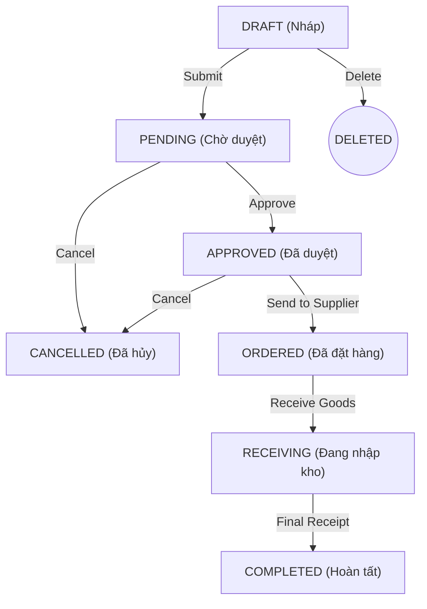

# Purchase Order (PO) Technical Specification

This document serves as the single source of truth for the **Purchase Order** module within the Manufacturing Execution System (MES). It describes the finalized business logic, data architecture, and API constraints currently implemented in the codebase.

---

## 1. Governance & Lifecycle

### 1.1 Status State Machine
The PO lifecycle follows a strict sequence of 7 states. Commands (POST) are used to advance state, while generic updates (PUT) are restricted by a mutability matrix.

*   **Cancel Lockout**: Once status reaches `ORDERED`, the contract is legally binding and the PO cannot be cancelled in the system.
*   **Draft Isolation**: POs in `DRAFT` status are private. Non-creators cannot view or list drafts of other users (403 Forbidden).

### 1.2 Two-State Numbering Pattern
To prevent "Missing Sequence" audit failures, official codes are only assigned upon submission:
1.  **Draft Code**: `D-PO-YYMMDD-{id}` (e.g., `D-PO-260328-47`).
2.  **Official Code**: `PO-YYYY-NNN` (e.g., `PO-2026-001`). Assigned atomically via a sequential counter (`CodeSequence`) when transitioning from `DRAFT` to `PENDING`.

---

## 2. Data Model (Schema)

The module utilizes four primary entities to ensure financial integrity and material traceability.

### 2.1 Core Models
*   **`PurchaseOrder`**: Header containing supplier, warehouse destination, and total financial calculation (`subtotal + (subtotal * taxRate) + shippingCost`).
*   **`PurchaseOrderDetail`**: Line items linking specific components to quantities and optional Production Requests.
* > [!IMPORTANT]
> **ComponentLot Traceability (The "Box" Rule & The "Slap" Workflow)**
> - The MES enforces strict Box-Level traceability for all incoming raw materials (Option 1).
> - When a PO arrives, the warehouse CANNOT just input "Received 1,000 aggregate units". They must explicitly register each supplier box into the system. The system auto-generates a unique `ComponentLot` ID (e.g., `LOT-260328-001`) which the worker must attach to the physical box.
> - **The "Slap" Workflow:**
>   1.  **Registry**: Worker scans/inputs box details. API generates the internal `lotCode`.
>   2.  **Labeling**: UI triggers a Barcode Popup (Virtual Label).
>   3.  **Application**: Worker "slaps" the identification on the physical box.
> - **The Issuing Rule**: When the Production floor requests materials (`MaterialExportRequest`), the warehouse worker MUST explicitly scan/select the exact `ComponentLot` barcodes they are picking from to maintain the end-to-end traceability chain.
*   **`CodeSequence`**: Shared counter table for atomic, scope-based sequence generation (e.g., `PO-2026`, `LOT-260328`).

### 2.2 Integrity Constraints
*   **Single Supplier**: A PO header is bound to one `supplierId`.
*   **Unique Components**: `@@unique([purchaseOrderId, componentId])`. A single component cannot appear twice on the same PO.
*   **BOM Validation**: If a line item is linked to a `productionRequestId`, the system validates that the component exists in that PR's Bill of Materials (BOM).

---

## 3. API Guards & Mutability Matrix

The backend enforces strict field-level restrictions to prevent "Bait-and-Switch" manipulation during the approval/negotiation process.

| Field Group | DRAFT | PENDING | APPROVED | ORDERED+ |
| :--- | :---: | :---: | :---: | :---: |
| **Financials** (tax, shipping, details, warehouse) | ✅ Editable | ❄️ **Frozen** | ❄️ **Frozen** | ❌ Locked |
| **Terms** (payment, delivery) | ✅ Editable | ❄️ **Frozen** | ❄️ **Frozen** | ❌ Locked |
| **Metadata** (note, expectedDeliveryDate) | ✅ Editable | ✅ Editable | ✅ Editable | ❌ Locked |
| **Priority** | ✅ Editable | ✅ Editable | ❄️ **Frozen** | ❌ Locked |

> [!NOTE]
> Financial fields are frozen in **PENDING** to ensure Managers approve the exact amount that will be paid. In **APPROVED**, priority is frozen as it reflects a management decision.

---

## 4. Warehouse & Traceability (Receiving)

The receiving flow (`POST /receive`) implements the **"Box Rule"** for incoming inventory.

### 4.1 Step-by-Step Atomic Flow
The system performs 4 operations atomically within a database transaction:
1.  **Fulfillment Update**: Increment `PurchaseOrderDetail.quantityReceived` (protected by Optimistic Locking to prevent double-scans).
2.  **Stock Upsert**: Increment global `ComponentStock` for the target warehouse.
3.  **Financial Audit**: Create an `InventoryTransaction` record of type `IMPORT_PO`.
4.  **Traceability Hook**: Create one `ComponentLot` record for **each box** passed in the payload.

### 4.2 Lot Code Format
*   **Format**: `LOT-YYMMDD-SEQ` (e.g., `LOT-260328-001`).
*   The sequence resets daily. Lot codes are unique system-wide.

### 4.3 PR Auto-Unblocking
If a received item is linked to a `ProductionRequest` (PR), the system checks if all materials for that PR have arrived. If fulfilled, the PR status is automatically upgraded (e.g., `WAITING_MATERIAL` → `PENDING`), unblocking the production line.

---

## 5. Security & RBAC

*   **`Admin + Purchasing Staff`**: Full management of lifecycle.
*   **`Production Manager`**: Specialized access to `/approve` and `/cancel`.
*   **`Warehouse Keeper`**: Restricted to `/receive` and `/lots` (viewing/printing labels).
*   **Ownership Lock**: Non-admins can only `DELETE`, `SUBMIT`, or `SEND_TO_SUPPLIER` for POs they personally created.
*   **Self-Approval Guard**: Managers are strictly prohibited from approving their own Purchase Orders.
## 6. Implementation & Architecture Notes

### 6.1 Defensive Integrity Guard (Double Lock)
To prevent inventory drift and race conditions during high-volume receiving:
- **Pre-flight Guard**: Standard validation of components and remaining quantities.
- **Optimistic Locking**: Uses atomic `updateMany` in Prisma with specific `where` clauses on `quantityReceived`. If a race condition occurs, the database returns a 409 Conflict.

### 6.2 Printing & Hardware Strategy
*   **Production Goal (Direct Sockets)**: Node.js acts as a print server sending raw ZPL/ESC-POS commands directly to printer IPs.
*   **Capstone/Demo (Virtual Printing)**: Uses `qrcode.react` to render scalable SVG barcodes on-screen. Scanning is handled via `@yudiel/react-qr-scanner` on worker phones, bypassing the need for specialized hardware.
*   **The "Slap" Rule**: API returns the generated `lotCode`, and the UI generates a virtual label for the worker to "slap" onto the physical box.
