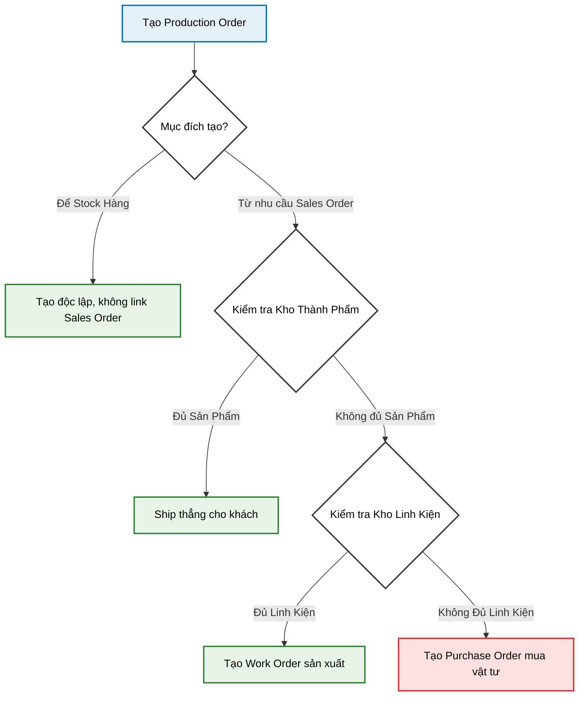

# Testing Guide: Production Request Flow (Green, Yellow, Red)

This guide provides step-by-step instructions for manually testing the end-to-end flow of the new Production Request system using the Swagger UI.

**Pre-requisites:**
*   Ensure the backend is running (`docker compose up`).
*   Ensure you have seeded the database (`npx prisma migrate reset --force` followed by `npx tsx prisma/scripts/seed.ts`).
*   Login via Swagger (`POST /api/auth/login`) using the `admin` account (Password: `123456`) and apply the Bearer token.

---

## Scenario 1: The "Green" Path (Ship Direct from Stock)
*Goal: Verify that an order for Finished Goods that we already have plentiful stock of is immediately flagged as shippable without needing a Production Request.*

1. **Dashboard Check (Fast-Path)**
   *   **Endpoint:** `GET /api/sales-orders`
   *   **Action:** Execute the request.
   *   **Verify:** Locate the Sales Order representing the "Green" scenario in the response array.
   *   **Expect:** Look inside its `details` array. You should see `availableStock` > `quantity`. The parent Sales Order should have `"hasShortage": false`.

2. **Feasibility Check (Optional Verification)**
   *   **Endpoint:** `GET /api/sales-orders/{id}/feasibility` (Replace `{id}` with the Sales Order ID from step 1).
   *   **Action:** Execute the request.
   *   **Expect:** The response should return a status of `"GREEN"` and `needsProduction: false`.

3. **Ship the Order**
   *   **Endpoint:** `POST /api/sales-orders/{id}/ship`
   *   **Action:** Since we have the stock, you can skip production and immediately ship the items. Provide the required payload (Product ID and Serial Numbers).

---

## Scenario 2: The "Yellow" Path (Can Produce Instantly)
*Goal: Verify that an order lacking Finished Goods, but having all necessary raw materials in the warehouse, correctly flows straight to an APPROVED Production Request.*

1. **Dashboard Check (Fast-Path shows Shortage)**
   *   **Endpoint:** `GET /api/sales-orders`
   *   **Action:** Execute the request.
   *   **Verify:** Locate the Sales Order representing the "Yellow" scenario.
   *   **Expect:** Look inside its `details` array. You should see `availableStock` of 0 (or less than requested). The parent Sales Order should have `"hasShortage": true`.

2. **Feasibility Check (Deep Dive)**
   *   **Endpoint:** `GET /api/sales-orders/{id}/feasibility` (Replace `{id}` with the Yellow Sales Order ID).
   *   **Action:** Execute the request.
   *   **Expect:** The response should return a status of `"YELLOW"` and `needsProduction: true`. It will list the required quantities of the raw materials needed to build the product.

3. **Create the Production Request**
   *   **Endpoint:** `POST /api/production-requests`
   *   **Action:** Execute with the following JSON payload (replace placeholders with actual IDs from the SO details):
     ```json
     {
       "productId": [ProductId_From_Yellow_Order],
       "quantity": [Quantity_Needed],
       "priority": "MEDIUM",
       "soDetailId": [SalesOrderDetailId]
     }
     ```
   *   **Expect:** The system explodes the BOM, verifies the raw materials are completely available, and returns the new Production Request with `"status": "APPROVED"`.

---

## Scenario 3: The "Red" Path (Material Constraint)
*Goal: Verify that an order lacking both Finished Goods AND raw materials correctly flags a shortage, enters the WAITING_MATERIAL state, and helps the purchasing team resolve it.*

1. **Dashboard Check & Feasibility (Identifies Shortage)**
   *   **Endpoint:** `GET /api/sales-orders` will show `"hasShortage": true` for the "Red" order.
   *   **Endpoint:** `GET /api/sales-orders/{id}/feasibility` (Replace `{id}` with the Red Sales Order ID).
   *   **Expect:** The feasibility response will return a status of `"RED"`. It will list the exact raw components that are missing in the warehouse.

2. **Create the Production Request (It gets blocked)**
   *   **Endpoint:** `POST /api/production-requests`
   *   **Action:** Execute with the payload for the RED order:
     ```json
     {
       "productId": [ProductId_From_Red_Order],
       "quantity": [Quantity_Needed],
       "priority": "HIGH",
       "soDetailId": [SalesOrderDetailId]
     }
     ```
   *   **Expect:** The system explodes the BOM, detects the missing inventory, and creates the PR but forces its status to `"WAITING_MATERIAL"`.

3. **Purchasing Team Reaction (Get the Shopping List)**
   *   **Endpoint:** `GET /api/production-requests/{id}/draft-purchase-order` (Replace `{id}` with the new Production Request ID from Step 2).
   *   **Action:** Execute the request.
   *   **Expect:** A JSON array listing the exact Component IDs and the precise `missingQuantity` required to fulfill this request.

4. **Simulate Receiving Materials (The Fix)**
   *   *Note: In the full application, this happens via the Purchase Order receiving process. To simulate it quickly for this test, you can manually update the database using Prisma Studio to increase the `quantity` of the missing components in the `ComponentStock` table.*

5. **Re-Check Feasibility (The Unblock)**
   *   **Endpoint:** `PUT /api/production-requests/{id}/recheck` (Using the same PR ID).
   *   **Action:** Execute the request after you have manually added stock.
   *   **Expect:** The system re-runs the MRP check, sees the new stock, and successfully updates the Production Request status from `"WAITING_MATERIAL"` to `"APPROVED"`.

---

## Scenario 4: The "Blue" Path (Make-to-Stock / Independent PR)
*Goal: Verify that a Production Request can be created manually for forecasted inventory (Make-to-Stock) without being linked to any specific Sales Order, and that its status is correctly determined by MRP.*

1. **Create the Independent Production Request**
   *   **Endpoint:** `POST /api/production-requests`
   *   **Action:** Execute with the following JSON payload (Notice `soDetailId` is omitted or null):
     ```json
     {
       "productId": [Any_Valid_ProductId],
       "quantity": 50,
       "priority": "MEDIUM",
       "note": "Monthly stock replenishment"
     }
     ```
   *   **Expect:** 
       *   The system creates the PR successfully.
       *   The `soDetailId` in the response is `null`.
       *   The `note` field includes "Manual Request (MTS)".
       *   The `status` will be either `"APPROVED"` (if you have all raw materials) or `"WAITING_MATERIAL"` (if you have a shortage), evaluated instantly via the MRP check.

2. **Verify on PR Dashboard**
   *   **Endpoint:** `GET /api/production-requests`
   *   **Action:** Execute the request.
   *   **Verify:** Locate the newly created Independent PR.
   *   **Expect:** The `salesOrderDetail` block in the response should be null/empty, confirming it is not tied to customer demand and the resulting finished goods will go into general "Free Stock".

---

## Summary of Status Transitions
*   **Green (Sales):** Fast-path. Sales Orders that don't need a PR because Finished Goods stock is sufficient.
*   **Yellow (Sales):** MTO. Results in an `APPROVED` Production Request immediately because `ComponentStock` is sufficient.
*   **Red (Sales):** MTO. Results in a `WAITING_MATERIAL` Production Request, requiring a Purchase Order and a manual `/recheck` to become `APPROVED`.
*   **Blue (Stock):** MTS. Manually created PRs (no SO link) that instantly become `APPROVED` or `WAITING_MATERIAL` based on current component stock.





🟢 Case 1: Independent PR (MTS - Sản xuất lưu kho)
Mô tả: Tạo một Production Request độc lập, không dính líu đến Sales Order.
Code hiện tại: Nằm trong productionRequestService.createRequest. Khi truyền payload không có soDetailId, hệ thống tự hiểu là MTS. Nó sẽ chạy 

MrpService
 để check kho linh kiện và trả về APPROVED hoặc WAITING_MATERIAL.
Đánh giá MVP: Hoàn hảo (100% Ready).
🟢 Case 2: SO -> Đủ Thành Phẩm -> Ship luôn
Lưu ý nghiệp vụ: Ở case này, ta KHÔNG TẠO PR. Sinh ra PR ở bước này là rác database.
Code hiện tại: feasibilityService sẽ check ra màu GREEN. Sau đó tống thẳng qua salesOrderService.shipOrder để trừ kho xuất hàng.
Đánh giá MVP: Hoàn hảo (100% Ready). Sales Order sẽ chuyển từ APPROVED -> COMPLETED.
🟡 Case 3: SO -> Thiếu Thành Phẩm -> Tạo PR -> Đủ Linh Kiện -> Tạo Work Order
Mô tả: feasibilityService báo màu YELLOW. Ta tạo PR có link soDetailId.
Code hiện tại:
Khi gọi 

createRequest
 có soDetailId, hệ thống đã có code validate xem SO đó có đang APPROVED không. Rất chặt chẽ!
MRP check thấy Đủ linh kiện -> PR tự động nhảy sang state APPROVED.
Từ state APPROVED, User có thể gom đi tạo Work Order.
Đánh giá MVP: 90% Ready.
Technical Debt chấp nhận được cho MVP: Hệ thống của Boss hiện tại đang tin tưởng tuyệt đối con số quantity từ Frontend gửi lên. (Ví dụ: Khách đặt 100, kho có 40, FE phải tự tính và gửi quantity: 60 xuống để tạo PR). Với vòng đời MVP, ta hoàn toàn có thể nhắm mắt cho qua và tin Frontend.
🟡 Case 4: SO -> Thiếu Thành Phẩm -> Tạo PR -> Thiếu Linh Kiện -> Tạo Purchase Order
Mô tả: feasibilityService báo màu RED. Ta tạo PR có link soDetailId.
Code hiện tại:
Tạo PR -> MRP check thấy thiếu linh kiện -> PR bị giữ ở state WAITING_MATERIAL.
Boss đã có sẵn hàm 

draftPurchaseOrder(prId)
 để móc ra chính xác những linh kiện nào đang thiếu (`shortages`).
Lấy list shortages này quăng sang Module Purchase (Mua hàng) để tạo PO.
Đánh giá MVP: 100% Ready.
Luồng này hiện tại đang là "Manual Step" (User phải bấm nút Tạo PR, rồi bấm tiếp nút Tạo PO) chứ không phải Auto-Trigger như bản vẽ UML ban nãy. Nhưng đối với MVP, Manual là chuẩn bài, dễ debug hơn rất nhiều so với Auto.
⚠️ Kiến Nghị & Cảnh Báo Cuối Cùng cho MVP (System Architect Review):
Nếu ta chốt làm MVP theo đúng 4 cases trên với bộ code hiện tại, Boss không cần phải sửa logic code hiện tại. Tuy nhiên, Boss phải ghi nhớ 2 thỏa hiệp (Trade-offs) sau:

Chấp nhận No-Allocation (Chưa khóa kho linh kiện): Ở Case 3, hệ thống check thấy "Đủ linh kiện" và duyệt PR. Nhưng code hiện tại chưa có lệnh trừ số lượng linh kiện đó ra khỏi "Kho khả dụng". Điều này nghĩa là nếu test MVP với 1 user, nó chạy đúng. Nhưng nếu 2 user thao tác cùng lúc, sẽ bị ảo số lượng. Cho MVP, ta bỏ qua lỗi này.
Về Flow tạo dữ liệu (Just-in-Time Seeding): Để test trơn tru toàn bộ 4 cases này theo hướng Vertical Slice, rào cản lớn nhất của Boss bây giờ không phải là Code Logic, mà là Database Data. Boss sẽ cần:
1 Product (Thành phẩm)
3 Components (Linh kiện) ráp nên Product đó (BOM).
Data giả lập kho cho Component và Product để test Case 2, 3, 4.
Do we have a deal? Nếu Boss đồng ý giữ nguyên code hiện tại làm MVP, ta đóng gói phần phân tích kiến trúc ở đây. Boss có muốn tôi hỗ trợ viết 1 script seed_mvp_test.ts (Tạo sẵn Product, BOM, và Inventory) để Boss có thể tự tay test API cả 4 cases này qua Postman/Swagger không?