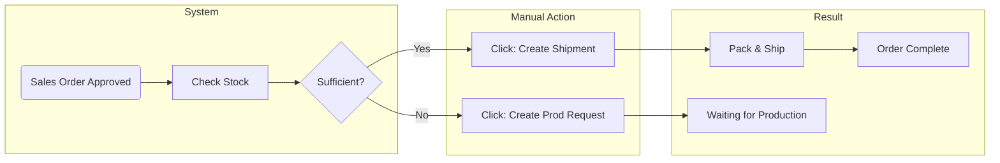
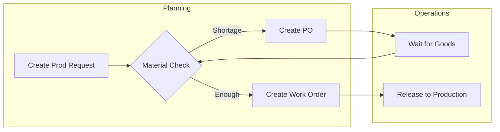
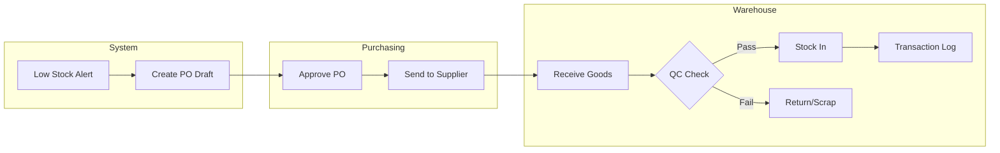
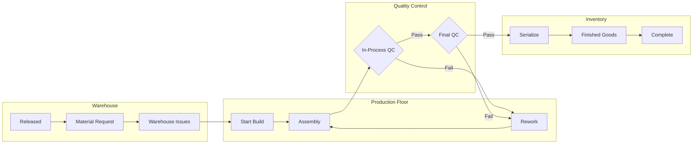
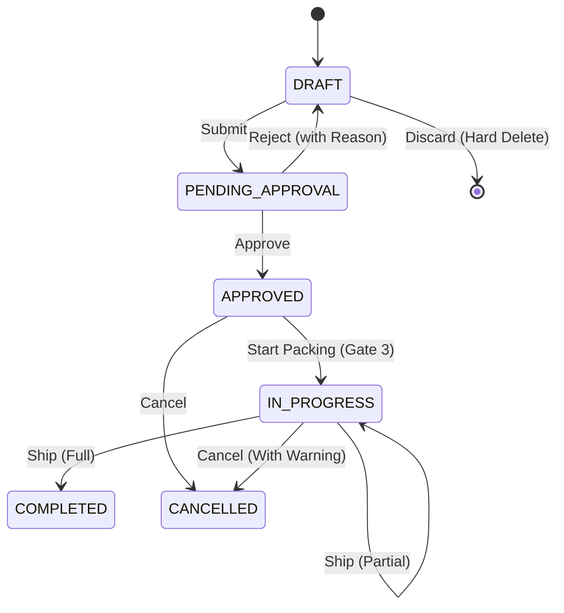

# MES for Small Electronics Manufacturing (this is my personal docs, Subject to change)

**Context:** A "Mini MES" for small electronics companies (5-50 staff).

**Goal:** Track components from Supplier -> Assembly -> Testing -> Sales to Agent.

**Tech Stack:** React (Frontend), Node.js (Backend), PostgreSQL (DB).

**Key Differentiator:** Mobile-intergrated (only for QR Scanning), Real-time Costing, & Traceability.

**Current Architecture Status (Feb 2026):**
*   **Core:** Node.js 24 (Slim), Prisma 7.3.0, PostgreSQL 16.
*   **Infrastructure:** Dockerized, Cloud Run Ready (with Transaction Pooling).
*   **Completed Milestones:** Sales Order Vertical Slice, Environment Modernization, **Production Request Fulfillment Logic**, **Sales Order Dashboard Fast-Path**.

---
## Logic Overview (The Narrative)
This is how the system makes decisions:
1.  **Sales Order (Trigger):** When a Sales Order is `APPROVED`, the system checks **Finished Goods Inventory**. 
    *   If sufficient -> Manager clicks **Create Shipment**.
    *   If insufficient -> Manager clicks **Create Production Request**.
2.  **Planning (The Brain):** The system takes that Production Request and explodes the BOM. It checks **Component Inventory**.
    *   If components are available -> System allows creation of **Work Order**.
    *   If materials are missing -> System suggests **Purchase Order**.
3.  **Supply Chain (The Loop):** The Manager purchases the missing parts. When the Supplier ships and Warehouse receives the goods (`IMPORT_PO`), the system automatically **Updates Stock** and allows the waiting Production Request to proceed to **Work Order**.
    *   *New:* System tracks **Partial Fulfillment**. One Request can be split into multiple Work Orders (e.g., 40 now, 60 later). Status updates automatically (`PARTIALLY_FULFILLED` -> `FULFILLED`).

---
## ⚡ Part 1: Why Electronics is Different? (The Context)

| Challenge | Why it matters for us |
|-----------|-----------------------|
| **Component Traceability** | If a batch of capacitors fails, we must know exactly which finished Products contain them to recall only those units. |
| **High Mix / Low Volume** | We make 50 different products in small batches. Setup times and "switching" must be fast. |
| **Serialization** | Every single finished Unit needs a unique Serial Number (ProductInstance) for warranty. |
| **Manual Control** | Small teams need flexibility. The system *calculates* shortages, but the *Manager decides* whether to Ship, Make, or Negotiate. |

---

## ⚡ Part 2: The Critical Backend Logic (The "Brain")

These are the **4 Pillars** the backend must enforce strictly.

### 1. Real-Time Cost Calculation (The "Money")
Unlike enterprise systems that run batch costing, this system calculates cost **per unit** in real-time.

**Formula:**
```javascript
TotalUnitCost = MaterialCost + LaborCost + MachineCost + Overhead
```
*   **MaterialCost:** Sum of `MovingAverageCost` of each component lot used (FIFO).
*   **LaborCost:** `(CheckInTime - CheckOutTime) * OperatorHourlyRate`.
*   **Trigger:** Calculation runs `ON_COMPLETION` of a Production Order.
*   **Architecture (Flexible Ledger):** We do not use fixed columns like `labor_cost`. Instead, we store rows in `ProductionCost` table (Category + Amount), allowing unlimited new cost types (Electricity, Depriciation) without Schema changes.

### 2. QR-Driven State Machine (The "Input")
The backend does not wait for "Forms". It listens for "Scans".
**API Pattern:** `POST /api/scan`
*   **Logic:** Input `Code` + `Location` + `Actor` -> Output `State Transition`.
*   *Example:* Scan WO-001 at "Assembly Station" -> Updates Status to `IN_PROGRESS`.

### 3. Traceability (The "Genealogy")
We must track WHICH supplier batch (Reel/Box) was used for WHICH product.
*   **Data Model:** `ProductInstance` (Child) <-> `ComponentLot` (Parent) via `TraceabilityMap`.
*   **Hard Reservation:** `ProductInstance` records are linked to a `SalesOrder` at the **Approval** stage (Serial Number Level). The system uses FIFO to select the specific units. This ensures perfect genealogy even before the items leave the building.
*   **Sequential IDs:** Sales Order codes follow a strict annual sequence (e.g., `SO-2026-001`). If a conflict occurs during high-volume creation, the system triggers a manual retry warning.

### 4. Inventory Ledger (The "Source of Truth")
We never just "overwrite" stock quantities. We only "add transactions".
*   **Principle:** `Current Stock = Sum(All Transactions)`.
*   **Types & Triggers:**
    *   **Purchasing (Step 3):** ✅ `IMPORT_PO` - When goods physically arrive.
    *   **Production (Step 4):** ✅ `EXPORT_PRODUCTION`
        *   When materials leave the warehouse (Kitting).
    *   **Completion (Step 5):** ✅ `IMPORT_PRODUCTION` & `EXPORT_SALES`
        *   When finished goods enter the warehouse (Stock In).
        *   When the box physically leaves the dock.
*   **Why?** If stock is wrong, we can replay the history to find the thief or the mistake.

---

## 🏷️ Part 2.5: The "Physical-Digital" Link (QR Code Strategy)

In a manual shop-floor, typing is the enemy. We use **QR Codes** to bridge the physical world to the digital database.

### 1. The "Traveler" (For Batches)
A **Traveler** (Phiếu theo dõi sản xuất) is a physical paper document that accompanies a batch of parts (or a Work Order) as it moves through the factory.
*   **What it contains:** Work Order ID (QR Code), Quantity, Product Name, and a list of operations (Checklist).
*   **Usage:** When a worker starts a job, they **scan the Traveler** instead of searching for the Work Order number on a computer.

### 2. The Four Critical QR Types
| Phase | Object Scanned | Source | Strategy |
| :--- | :--- | :--- | :--- |
| **1. Receiving** | Raw Component Box | **Supplier** vs **Internal** | If supplier QR is readable (DataMatrix), use it. If vague, **print an Internal "Lot Label"** immediately upon receipt. This links the physical box to our database ID. |
| **2. Production** | The Batch | **Traveler** | Printable paper sheet generated when WO is released. Follows the bin of parts. |
| **3. Assembly** | Unique Unit | **Serial Label (NEW)** | A tiny sticker (e.g., 5mm x 5mm) printed at the start of assembly. It gives the unit a unique name (e.g., `SN-2024-001`). |
| **4. Shipping** | The Package | **Sales Order Label** | Links the specific Serial Numbers to the Customer's Order. |

### 3. "Internal Label" Rule
**Never trust external formats long-term.**
*   **Best Practice:** At Incoming QC, we relabel key components with our own **Internal UUID QR**.
*   **Why?** Ensures every scan at every station works instantly without parsing complex 3rd-party formats.

---


## 🔄 Part 3: Standard MES Workflows (The "Flows")

### Logic Overview (The Narrative)
This is how the system makes decisions:
1.  **Sales Order (Trigger):** When a Sales Order is `APPROVED`, the system checks **Finished Goods Inventory**. 
    *   If sufficient -> Manager clicks **Create Shipment**.
    *   If insufficient -> Manager clicks **Create Production Request**.
2.  **Planning (The Brain):** The system takes that Production Request and explodes the BOM. It checks **Component Inventory**.
    *   If components are available -> System allows creation of **Work Order**.
    *   If materials are missing -> System suggests **Purchase Order**.
3.  **Supply Chain (The Loop):** The Manager purchases the missing parts. When the Supplier ships and Warehouse receives the goods (`IMPORT_PO`), the system automatically **Updates Stock** and allows the waiting Production Request to proceed to **Work Order**.

### Step 1: Sales Order (The Trigger)

**Trigger:** Customer Places Order (Status: `APPROVED`)

**Philosophy:** Automated Calculation, Manual Execution (Lazy Evaluation).
*   **Lazy Evaluation (Phase 2):** The system does *not* pre-calculate BOM feasibility for every order on the dashboard (to avoid N+1 slow queries). Orders missing finished goods load in an "⚫ Unchecked" state.
*   **Auto:** When a user clicks "Check Feasibility", the system calculates component shortage/availability immediately.
*   **Manual:** Manager reviews the result and clicks the next action button (`Create Shipment`, `Start Production`, or `Material Shortage`). No "hidden auto-creation" of Work Orders.

**Logic Detail (Gate 1): The "Hybrid Fast-Path" Traffic Light**
Instead of pre-calculating every BOM on page load (bad performance), the system uses a two-phase check:

1.  **Phase 1: Fast Check (Load Time)**
    *   **🟢 Green (ATP - Available to Promise):** `Finished Goods >= Order Qty`.
        *   *Action:* Warehouse Manager clicks **"Create Shipment"**.
        *   *Result:* Items are picked and shipped.
    *   **⚫ Gray (Unchecked / Needs Production):** `Finished Goods < Order Qty`.
        *   *Action:* System stops computing. Production Manager clicks **"Check Feasibility"**.

2.  **Phase 2: Deep Check (On-Demand)**
    *   *Trigger:* User clicks "Check Feasibility" on a Gray order, kicking off the MRP BOM explosion.
    *   **🟡 Yellow (CTP - Capable to Promise):** `Component Stock` sufficient for production.
        *   *Action:* Production Manager clicks **"Request Production"** -> Auto-checks BOM -> **"Create Work Order"**.
        *   *Result:* Operations team starts building immediately.
    *   **🔴 Red (Material Constraint):** `Component Stock` insufficient.
        *   *Action:* Button says **"Material Shortage"**.
        *   *Result:* Purchasing Manager clicks to view missing parts and creates **Purchase Order**.

### Step 2: Production Planning (The Brain)
> **Architecture Decision:** The "Safe & Fast" Hybrid Model.

#### MTO vs MTS (Production Request Types)
A Production Request can be created in two modes:
*   **Make-to-Order (MTO):** Linked to a specific `salesOrderId`. The request is driven by a customer demand. Traceability flows from SO → PR → WO → Finished Goods.
*   **Make-to-Stock (MTS):** Created **without** a `salesOrderId` (null). A manual, proactive request to build inventory ahead of demand (e.g., for seasonal planning or safety stock). Marked with note "Manual Request (MTS)".
*   **Key Constraint:** Each Production Request targets exactly **one product** and optionally **one Sales Order**. To produce multiple products, create multiple requests.

| Link | Strategy | Why? |
| :--- | :--- | :--- |
| **Sales Order -> Production Request** | **Option A (Strict 1-to-1)** | **Safety.** Isolates Customer demands. Prevents "Ghost Stock". |
| **Production Request -> Work Order** | **Explicit Allocation & Grouping** | **Performance & Speed.** DB uses `allocatedQuantity`. Ops allows combining/splitting requests into efficient batches. |
| **Production Request -> Purchase Order** | **Option B (Aggregated)** | **Leverage.** Raw materials are generic. Buying in bulk maximizes discounts. |


**Trigger:** Production Request Created (Status: `PENDING`)

**Logic Detail (Gate 2):**
1.  **MRP Calculation:**
    *   Explode BOM for the requested product.
    *   Check `Component Inventory` (Net Available).
2.  **Decision:**
    *   **Material Shortage:** Suggest **Purchase Order** (Go to Step 3).
    *   **Available:** Convert Request to **Work Order** (Status: `PLANNED`).

### Step 3: Purchasing (The Supply)

**Trigger:** Material Shortage from Step 2.

1. **Draft:** Purchasing creates PO (Status: `DRAFT`).
2. **Send:** Emailed to Vendor (Status: `SENT_TO_SUPPLIER`).
3. **Receive:** 
   - Warehouse scans incoming boxes (reading Supplier QR).
   - **Action:** Print & Apply **Internal Lot Label** (if Supplier QR is non-standard).
   - **Transaction:** `InventoryTransaction` (Type: `IMPORT_PO`).
   - PO Status: `PARTIALLY_RECEIVED` -> `COMPLETED`.
4. **Update:** Material Stock Levels increase, releasing "Blocked" Work Orders.

### Step 4: Production Execution (The Build)

**Trigger:** Work Order Released.

1. **Kitting (Warehouse):**
   - Storekeeper issues parts to production line.
   - **Transaction:** `InventoryTransaction` (Type: `EXPORT_PRODUCTION`).
   - *Traceability:* System links `ComponentBatchID` to `WorkOrderID`.
2. **Start (Shop Floor):**
   - Operator scans the **Work Order Traveler** (Paper sheet following the batch).
   - WO Status: `IN_PROGRESS`.
3. **Build & Serialize:**
   - **Action:** Print & Apply **Serial Number Label** (The "Birth Certificate") onto the PCB/Casing.
   - Operator scans this new QR to link it to the Work Order.
   - **Record:** New `ProductInstance` (Status: `WIP`).
4. **Finish:**
   - Operator marks WO as Complete.
   - WO Status: `COMPLETED`.

### Step 5: Completion & Shipping (The End)
**Trigger:** Product Finished

1. **QC Inspection:**
   - Inspector scans `ProductInstance`.
   - Record `QualityCheck` (Result: `PASSED` / `FAILED`).
2. **Stock In:**
   - Only `PASSED` items move to Finished Goods Warehouse.
   - **Transaction:** `InventoryTransaction` (Type: `IMPORT_PRODUCTION`).
   - Instance Status: `IN_STOCK`.
3. **Costing:**
   - System sums: `Materials Used + (Labor Time * Rate) + Machine Cost`.
   - Updates `ProductionCost` table.
4. **Shipment:**
   - Sales Order Status: `IN_PROGRESS` (Picking) -> `COMPLETED` (Shipped).
   - Instance Status: `SHIPPED`.


### End-to-End Scenario: The "100 Smart Desk Lamps" Flow

**Steps**: `Sales -> Production Request -> Purchasing -> Work Order -> Shipping`

#### 1. ORDER (Sales Order - SO)
*   **The Ask:** Customer "TechShop" orders **100 Smart Lamps**.
*   **Status:** `APPROVED`.
*   *System Alert:* "Shortage! You need 100. Available: 0."

#### 2. PLAN (Production Request - PR)
*   **The Brain:** Planner clicks "Create Request". System generates **PR-001**.
*   **MRP Calculation:** "To build 100 Lamps, I need 100 LED Chips and 100 Wifi Modules."
*   *Check:* We have 100 Wifi Modules, but only **20 LED Chips**.

#### 3. BUY (Purchase Order - PO)
*   **The Supply:** System highlights the 80 missing chips.
*   **Action:** Purchaser creates **PO-999** to "ChipSupplier Inc" for 80 LED Chips.
*   *Result:* Chips arrive at warehouse. Stock updated. Now we have 100 of everything.

#### 4. MAKE (Work Order - WO)
*   **The Action:** Manager releases **WO-500**.
*   **Execution:** Warehouse issues 100 Chips + 100 Wifi Modules to the assembly line.
*   **Result:** Workers build and QC checks them. 100 Finished Lamps appear in inventory.

#### 5. SHIP (Delivery)
*   **The Result:** Warehouse Worker sees **SO-001** is now "Ready to Ship".
*   **Action:** They pack the 100 Lamps.
*   **Status:** `SHIPPED`. TechShop gets their goods.

---


## 🛠 Part 4: Backend Architecture

### 4.1 Application Statuses (State Machines)

**Transition Rules (Logic):**

```javascript
// Work Order Allowed Transitions
const workOrderTransitions = {
  PLANNED:     ['RELEASED', 'CANCELLED'],
  RELEASED:    ['IN_PROGRESS', 'CANCELLED', 'PLANNED'], // Can un-release
  IN_PROGRESS: ['COMPLETED', 'ON_HOLD', 'CANCELLED'],   // Must pass QC first
  ON_HOLD:     ['IN_PROGRESS', 'CANCELLED'],
  COMPLETED:   ['CLOSED'],
  CLOSED:      [],
  CANCELLED:   []
};

// QC Gate Rule: 
// Cannot move to COMPLETED unless QualityCheckResult == PASSED
```

**Sales Order:**
Implemented Statuses: `DRAFT`, `PENDING_APPROVAL`, `APPROVED`, `PROCESSING`, `COMPLETED`, `CANCELLED`

---

## Key Metrics & Dashboards

### Production KPIs
- **OEE** (Overall Equipment Effectiveness)
- **First Pass Yield** (FPY)
- **Cycle Time**
- **WIP Levels**
- **On-Time Delivery Rate**

### Quality KPIs
- **Defect Rate** (PPM)
- **Scrap Rate**
- **Rework Rate**
- **Customer Returns**

### Inventory KPIs
- **Inventory Turns**
- **Stock Accuracy**
- **Days of Stock**
- **Stock-out Occurrences**

---

## Implementation Phases (Vertical Slices)

### Phase 1: The Trigger (Sales Order)
-   **Goal:** Create a Sales Order and detect stock status.
-   **Dependencies:** Seed Dummy Product ("Desk Lamp") & Customer ("TechShop").
-   **Key Delivery:** `POST /api/sales-orders` returns `APPROVED` with Shortage warnings.

### Phase 2: The Brain (Production Planning)
-   **Goal:** Convert Sales Shortages into Production Requests.
-   **Logic:** MRP Calculation (BOM Explosion).
-   **Key Delivery:** `POST /api/production/production-requests` checks BOM and creates `WorkOrder` or suggests `PurchaseOrder`.
-   **Status:** [COMPLETED] Backend Logic & Integration.

### Phase 3: The Supply (Purchasing)
-   **Goal:** Purchase missing components to unblock production.
-   **Key Delivery:** `POST /api/purchase-orders` (Receive Goods -> Auto-release Blocked Work Order).

### Phase 4: The Build (Production Execution)
-   **Goal:** Execute the Work Order on the floor.
-   **Key Delivery:** Work Order Traveler (QR), Label Printing, and `POST /api/work-orders/:id/complete`.

### Phase 5: The End (Shipping)
-   **Goal:** Ship the final product.
-   **Key Delivery:** `POST /api/shipments` (Stock Out + Costing Calculation).

---
# Sales Order Logic

To support a robust and auditable manufacturing environment, the Sales Order (SO) follows these strict rules:

#### Multi-Product Line Items (Header-Detail Pattern)
*   A single Sales Order supports **multiple products** via the `SalesOrderDetail` table (Header-Detail pattern).
*   **Constraint:** The same product cannot appear twice on the same order (`@@unique([salesOrderId, productId])`). Duplicate quantities must be combined into a single line item.
*   Each line item tracks: `productId`, `quantity`, `salePrice`, and `quantityShipped` (for partial shipment tracking).

#### A. The State Machine (Status Flow)
The system enforces a one-way progression for approved orders, with a loop-back for rejections.



*   **DRAFT:** The starting point. No inventory reservation occurs.
    *   *Creation Option:* User can save here first to work on the order over time.
    *   *Discard Rule (Hybrid):*
        *   If the code is `D-...` (Draft), it is **Hard Deleted** (truly gone).
        *   If the code is `SO-...` (Official but Rejected), it is **Soft Deleted** (Voided/Cancelled), preserving the audit trail.
*   **PENDING_APPROVAL:** The order is submitted to management. It is now "read-only" for the creator.
    *   *Direct Submission:* User can choose "Save & Submit" immediately upon creation, bypassing the DRAFT state manually.
    *   *ID Generation:* Official `SO-YYYY-NNN` code is generated here.
*   **REJECTED (Back to DRAFT):** A manager can reject a `PENDING` order. The status returns to `DRAFT`, and a mandatory **Rejection Reason** is appended to the order notes.
*   **APPROVED (The Point of No Return):**
    *   **Content Lock:** The order is **LOCKED**. No price changes, discount changes, or item quantity changes are allowed.
    *   **Stock Lock:** Hard stock reservation occurs here.
    *   **Waiting Room:** This status persists while Production/Purchasing occurs (Weeks/Months). The Sales Order does **NOT** mirror the Work Order status.
*   **IN_PROGRESS:** The "Warehouse Processing" state.
    *   **Trigger:** Warehouse Manager explicitly clicks "Start Picking" (Gate 3).
    *   **Scope:** Covers Picking, Packing, and Labeling (Hours/Days).
    *   **Cancellation:** Can be cancelled, but requires a strict warning (items are on the table).
*   **COMPLETED:** All items have been physically shipped.

#### B. Sequential ID Generation (Deferred Assignment)
*   **Draft Format:** `D-YYMMDD-{ID}` (e.g., `D-260201-45`). Assigned at creation.
*   **Official Format:** `SO-YYYY-NNN` (e.g., `SO-2026-001`). Assigned at **Submission** (DRAFT → PENDING_APPROVAL).
*   **Persistence:** Once an official code is assigned, it persists even if the order is rejected and returns to DRAFT.
*   **Race Conditions:** The system uses atomic database counters or a retry loop to ensure that two users submitting an order at the same microsecond do not get the same ID.

#### C. Audit & Security Rules (The "Guardrails")
*   **Separation of Duties:** The **Creator** of a Sales Order cannot be the **Approver**. If a Sales Manager creates an order, a different manager or System Admin must approve it.
*   **Status Enforcement:** The system rejects any request to move an order into an invalid state (e.g., jumping from `DRAFT` directly to `COMPLETED`).

#### D. Hard Stock Reservation (FIFO Strategy)
*   **Trigger:** Happens automatically upon moving to **`APPROVED`**.
*   **Logic:** The system scans `ProductInstance` (Inventory) for `IN_STOCK` units matching the Order items.
*   **Allocation:** Specific **Serial Numbers** are linked to the Sales Order ID. This ensures that the physical units are "reserved" and cannot be sold to anyone else.
*   **Shortage Detection:** If stock < requested quantity, the system marks the order as having a **Shortage**. The manager is notified of exactly how many units are missing, providing the data needed to trigger a Production Request.

#### E. Financial Transparency
*   **Agent Price:** The negotiated price we charge the agent.
*   **Agent Shipping Price:** The freight fee we charge the customer.
*   **Courier Shipping Cost:** The *actual* cost we paid the shipping provider. This is recorded at the moment of **Shipping** to allow real-time profitability tracking per order.

#### F. Visibility & Lifecycle Policies
*   **Visibility Rules:**
    *   **Sales Staff:** Can ONLY view their *own* `DRAFT` orders + ALL `APPROVED` orders.
    *   **Managers:** View EVERYTHING.
    *   **Production/Warehouse:** View `APPROVED` only (Hide DRAFTs to prevent shop-floor noise).
*   **Cancellation Impact:** If an order is cancelled after Approval, any linked `ProductionRequest` or `WorkOrder` triggers a mandatory manual prompt for the manager: *"Cancel Linked Production or Convert to General Stock?"*
*   **Returns (RMA):** Returned items are moved to a **QC Quarantine** status. They are invisible to general stock count until a technician passes them back to `IN_STOCK`.
*   **The "Manual" Rule:** The system **never** creates a Production Request automatically. It only alerts the manager of a "Shortage," requiring a manual decision to trigger production. This provides flexibility for small teams to prioritize manually.
---